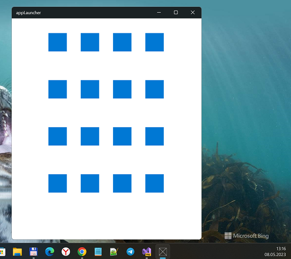
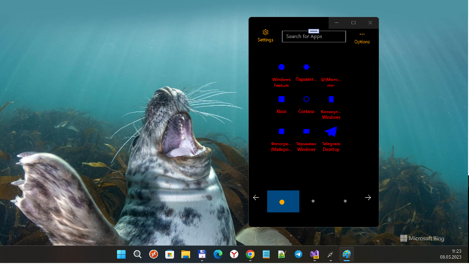

## appLauncher (appLauncher-dev codename)
- Android-like Home Screens RnD for Windows 10 "family" (UWP)
- Based on old-version of [appLauncher](https://github.com/IsaacMorris1980) by Isaac Morris

## Screenshot(s)

## My plan of research
- Research "Add new folders" feature
- Research "app settings synchronization across devices" (via OneDrive / MSGraph?)
- Solve the W10M OS registry mystery how to start "alternative shell" when os starts up... :)   

## References
- [The original appLauncher](https://github.com/IsaacMorris1980/appLauncher)
- [Isaac Morris aka IsaacMorris1980's Github](https://github.com/IsaacMorris1980)

## ..
As-is. Research only. DIY

## .
-- me 2023
